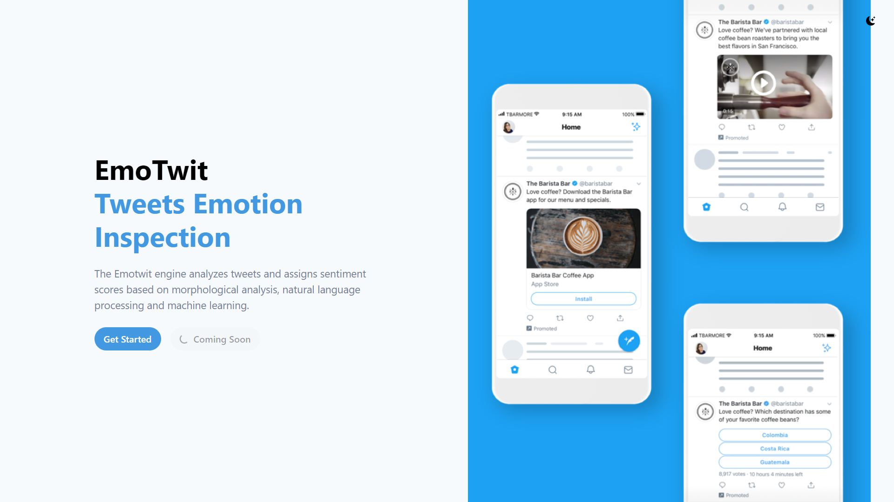

<div id="top"></div>
<!--
*** Thanks for checking out the Best-README-Template. If you have a suggestion
*** that would make this better, please fork the repo and create a pull request
*** or simply open an issue with the tag "enhancement".
*** Don't forget to give the project a star!
*** Thanks again! Now go create something AMAZING! :D
-->

<!-- PROJECT SHIELDS -->
<!--
*** I'm using markdown "reference style" links for readability.
*** Reference links are enclosed in brackets [ ] instead of parentheses ( ).
*** See the bottom of this document for the declaration of the reference variables
*** for contributors-url, forks-url, etc. This is an optional, concise syntax you may use.
*** https://www.markdownguide.org/basic-syntax/#reference-style-links
-->

[![Contributors][contributors-shield]][contributors-url]
[![Forks][forks-shield]][forks-url]
[![Stargazers][stars-shield]][stars-url]
[![Issues][issues-shield]][issues-url]
[![MIT License][license-shield]][license-url]
[![LinkedIn][linkedin-shield]][linkedin-url]

<!-- PROJECT LOGO -->
<br />
<div align="center">
  <a href="https://github.com/muame-amr/EmoTwit">
    
  </a>

<h3 align="center">Sentiment Analysis Web Application</h3>

  <p align="center">
    Real time sentiment analysis web application
    <br />
    <a href="https://github.com/muame-amr/EmoTwit"><strong>Explore the docs »</strong></a>
    <br />
    <br />
    <a href="https://github.com/muame-amr/EmoTwit">View Demo</a>
    ·
    <a href="https://github.com/muame-amr/EmoTwit/issues">Report Bug</a>
    ·
    <a href="https://github.com/muame-amr/EmoTwit/issues">Request Feature</a>
  </p>
</div>

<!-- TABLE OF CONTENTS -->
<details>
  <summary>Table of Contents</summary>
  <ol>
    <li>
      <a href="#about-the-project">About The Project</a>
      <ul>
        <li><a href="#built-with">Built With</a></li>
      </ul>
    </li>
    <li>
      <a href="#getting-started">Getting Started</a>
      <ul>
        <li><a href="#prerequisites">Prerequisites</a></li>
        <li><a href="#installation">Installation</a></li>
      </ul>
    </li>
    <li><a href="#usage">Usage</a></li>
    <li><a href="#license">License</a></li>
    <li><a href="#contact">Contact</a></li>
    <li><a href="#acknowledgments">Acknowledgments</a></li>
  </ol>
</details>

<!-- ABOUT THE PROJECT -->

## About The Project



EmoTwit builds and uses classifiers based on neural networks to analyze tweets for emotions in real time and classifies them as positive or negative.
Then it generates a sentiment score based and percentage of positiveor negative tweets.
No more filling out spreadsheets for sentiment analysis. Read more details on neural network [here](https://github.com/muame-amr/EmoTwit/blob/main/sentiment-analysis-model/README.md). API Docs can be find [here](https://github.com/muame-amr/EmoTwit/blob/main/twitter-rest-api/README.md).

### Built With

- [Next.js](https://nextjs.org/)
- [ChakraUI](https://chakra-ui.com/)
- [Maven](https://maven.apache.org/)
- [Quarkus](https://quarkus.io/)
- [Deeplearning4j](https://deeplearning4j.konduit.ai/)

---

<!-- GETTING STARTED -->

## Getting Started

All datasets, vector models and neural network models can be downloaded [here](https://drive.google.com/drive/folders/1k7z67Pr5PG16OM2jlKKMSXjrZamImmyl?usp=sharing).

### Prerequisites

#### NextJS & ChakraUI

- NodeJS
- Any code editor e.g. VSC, Atom

#### Deeplearning4J & Quarkus

- Java Developer Version
- Apache Maven
- IntelliJ IDEA or Eclipse
- Git

### Installation

1. Clone the repo
   ```sh
   git clone https://github.com/muame-amr/EmoTwit.git
   ```
2. Insert datasets and models into `sentiment-analysis-model\src\main\resources` folder (create directory if doesn't exist)
3. Open project in IntelliJ IDEA
   - Train model:
     1. Open `sentiment-analysis-model/` project
     2. Ensure the dataset and models path in `sentiment-analysis-model\src\main\java\model\word2vec\UptrainingWord2Vec.java` and `sentiment-analysis-model\src\main\java\model\RNN\SentimentClassifier.java` files are correct.
     3. Run `UptrainingWord2Vec.java` to train word vectors and `SentimentClassifier.java` to train text classification model
   - Start back-end server:
     1. Open `twitter-rest-api` project
     2. Create `twitter4j.properties` files in project root directory
     3. Write these details inside that file:
     ```Java
     oauth.consumerKey= <your-consumer-key>
     oauth.consumerSecret= <your-consumer-secret>
     oauth.accessToken= <your-access-token>
     oauth.accessTokenSecret= <your-token-secret>
     ```
     4. Open terminal in IntelliJ and start quarkus server:
     ```sh
     quarkus dev
     ```
4. Launch website
   1. Open `webapp` folder and install all packages
   ```node
   npm install
   ```
   2. Launch web server
   ```node
   npm run dev
   ```

---

<!-- USAGE EXAMPLES -->

## Usage


EmoTwit is a twitter analyzer powered by Artificial Intelligence to read the emotions in your tweets.
Simply input the tweet you want to analyse to discover what kind of mood it suggests.
You don't even have to have an account or write a new tweet, just copy and paste it into the app and we'll analyze it for you.
It's that easy!

---

<!-- LICENSE -->

## License

Distributed under the MIT License. See `LICENSE.txt` for more information.

## <!-- CONTACT -->

## Contact

Your Name - [@mu4m3](https://twitter.com/mu4m3) - email@gmail.com

Project Link: [https://github.com/muame-amr/EmoTwit](https://github.com/muame-amr/EmoTwit)

## <!-- ACKNOWLEDGMENTS -->

## Acknowledgments

- Malaya Semi-Supervised Malay Tweets [Datasets](https://github.com/huseinzol05/malay-dataset) by Husein Zolkepli
- Malaysian Text from Twitter [Datasets](https://www.kaggle.com/datasets/ilhamfp31/malaysia-twitter-sentiment) by Husein Zolkepli
- Malaysia Wiki [Word Vectors](https://github.com/AsyrafAzlan/malay-word2vec-tsne) by Asyraf Azlan

<p align="right">(<a href="#top">back to top</a>)</p>

<!-- MARKDOWN LINKS & IMAGES -->
<!-- https://www.markdownguide.org/basic-syntax/#reference-style-links -->

[contributors-shield]: https://img.shields.io/github/contributors/muame-amr/EmoTwit.svg?style=for-the-badge
[contributors-url]: https://github.com/muame-amr/EmoTwit/graphs/contributors
[forks-shield]: https://img.shields.io/github/forks/muame-amr/EmoTwit.svg?style=for-the-badge
[forks-url]: https://github.com/muame-amr/EmoTwit/network/members
[stars-shield]: https://img.shields.io/github/stars/muame-amr/EmoTwit.svg?style=for-the-badge
[stars-url]: https://github.com/muame-amr/EmoTwit/stargazers
[issues-shield]: https://img.shields.io/github/issues/muame-amr/EmoTwit.svg?style=for-the-badge
[issues-url]: https://github.com/muame-amr/EmoTwit/issues
[license-shield]: https://img.shields.io/github/license/muame-amr/EmoTwit.svg?style=for-the-badge
[license-url]: https://github.com/muame-amr/EmoTwit/blob/master/LICENSE.txt
[linkedin-shield]: https://img.shields.io/badge/-LinkedIn-black.svg?style=for-the-badge&logo=linkedin&colorB=555
[linkedin-url]: https://linkedin.com/in/muame
[product-screenshot]: images/screenshot.png
