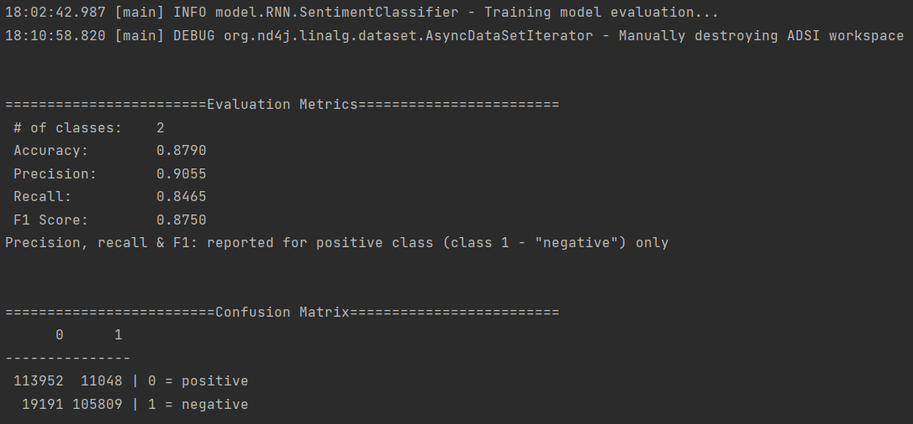
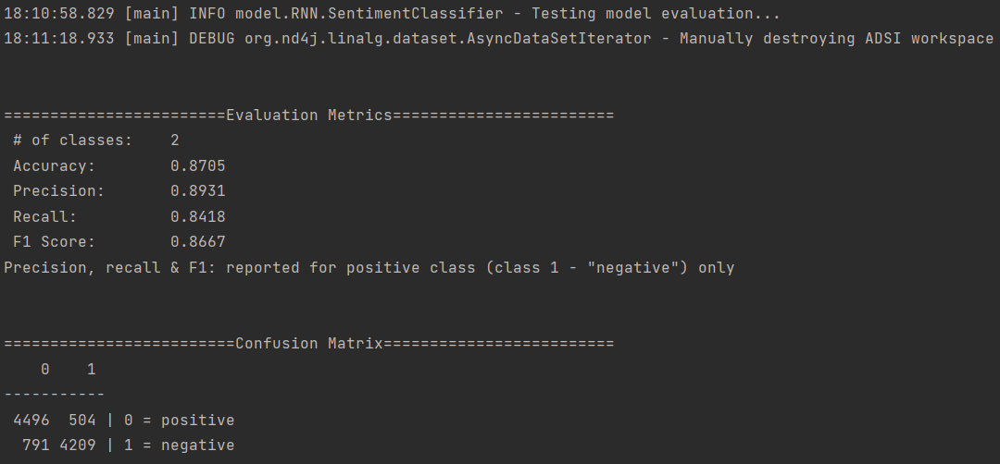

# Malay Twitter Sentiment Analysis Model using Neural Network with DL4J

The [Eclipse Deeplearning4J](https://deeplearning4j.konduit.ai/) (DL4J) ecosystem is a collection of projects designed to meet all of the requirements of a JVM-based deep learning application. Starting with raw data and loading and preprocessing it from wherever and whatever format it is in, this entails building and tuning a wide range of simple and complex deep learning networks.

This project aim to evaluate the sentiment of Malaysian Twitter using a Neural Network. Word2Vec is used to generate the word embedding for the words in the tweets. The word embedding is then used to train a Neural Network to predict the sentiment of the tweets. The sentiment is then evaluated using the Evaluation Metrics such as accuracy, precision, recall, F1-score, and confusion matrix.

---

## Word2Vec

Word2Vec is a two-layer neural net that processes text to generate word embedding that takes a set of words and generates a vector representation of the words. In this project, pre-trained malaysian wiki vectors used to uptrain the word2vec model with processed twitter sentiments dataset.

These are the configuration of the Word2Vec model:

| Parameters            | Value  |
| --------------------- | ------ |
| Layers                | 300    |
| Window                | 5      |
| Minimum Word Freq     | 3      |
| Learning Rate         | 0.025  |
| Minimum Learning Rate | 0.0001 |
| Batch                 | 512    |
| Iterations            | 1      |
| Epochs                | 1      |
| Vocabs                | 175214 |

---

## Neural Network

### Recurrent Neural Network (RNN)

RNN is a type of Neural Network that is able to process a sequence of data. Long Short-Term Memory (LSTM) is used to avoid vanishing gradient problem in RNN.
Gradients can be preserved using an LSTM. As long as the forget gate is open and the input gate is closed, the memory cell remembers the first input.

These are the configuration of the RNN model:

| Parameters            | Value                     |
| --------------------- | ------------------------- |
| Batch                 | 128                       |
| Vectors               | 300                       |
| Epochs                | 2                         |
| Optimizer             | Adam                      |
| Learning Rate         | 0.005                     |
| L2 Regularisation     | 0.00001                   |
| LSTM Layer 1 Size     | 256                       |
| LSTM Layer 2 Size     | 384                       |
| LSTM Layer 3 Size     | 128                       |
| Activation            | Hyperbolic Tangent        |
| RNN Output Layer Size | 2                         |
| Output Activation     | Softmax                   |
| Loss Function         | Multi Class Cross Entropy |

### Convolutional Neural Network

CNN is a neural network that consist of several layers of convolutional layers and pooling layers. The convolutional layers are used to extract features from the input data. The pooling layers are used to reduce the dimension of the feature map.

These are the configuration of the RNN model:

| Parameters                        | Value                     |
| --------------------------------- | ------------------------- |
| Batch                             | 128                       |
| Vectors                           | 300                       |
| Epochs                            | 2                         |
| Weight Initializer                | RELU                      |
| Optimizer                         | Adam                      |
| Learning Rate                     | 0.005                     |
| L2 Regularisation                 | 0.0001                    |
| Convolutional Layer 1 Kernel Size | [3, 300]                  |
| Convolutional Layer 2 Kernel Size | [4, 300]                  |
| Convolutional Layer 3 Kernel Size | [5, 300]                  |
| Activation                        | LeakyRELU                 |
| Feature Map Size                  | 300                       |
| Pooling Layer Type                | Global Pooling            |
| Pooling Layer Dropout             | 0.5                       |
| Output Activation                 | Softmax                   |
| Loss Function                     | Multi Class Cross Entropy |

---

## Evaluation Metrics

Evaluation Metrics such as accuracy, precision, recall, F1-score, and confusion matrix are used to evaluate the model. F1-score, the harmonic mean of precision and recall is more preferred metric since it can be interpreted as a weighted average of the precision and recall thus, imbalance classes can be taken into account.

---

## Results

### RNN

Training evalution:

Testing evaluation:

### CNN

Training evalution:

Testing evaluation:

---

## Useful Articles

1. [Word2Vec Tutorial - The Skip-Gram Model](http://mccormickml.com/2016/04/19/word2vec-tutorial-the-skip-gram-model/)
2. [Text Classification - RNNs or CNNs](<https://towardsdatascience.com/text-classification-rnns-or-cnn-s-98c86a0dd361#:~:text=RNNs%20usually%20are%20good%20at,faster%20(~%205x%20)%20than%20RNN.>)
3. [RNN Training Tips and Tricks](https://towardsdatascience.com/rnn-training-tips-and-tricks-2bf687e67527#:~:text=Solutions%20to%20this%20are%20to,number%20of%20neurons%20per%20layer)
